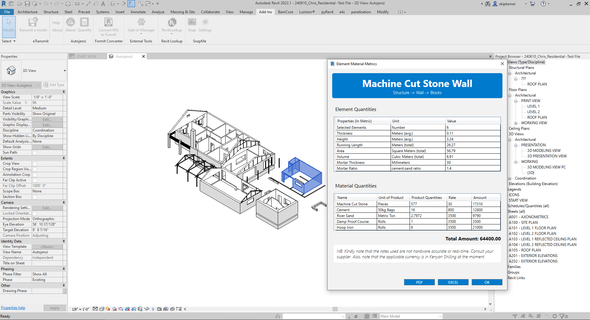

# Autojenzi
  

 

***Building Material Metrics in Real time!***

 
## 📋 Summary

There are many factors that influence the design outcome of your construction project 👷‍♂️ .
Building Material data may not be one them despite contributing up to 70% of the total 
construction cost.

Is material data an afterthought when you are designing 🤔 ?

Not any more! Autojenzi has a solution for you. In real-time ⏳ , you can now access your 
building materials data as you design.

Hypothetically, The enclosing building elements such as floor, roof and walls in BIM Models
are devoid of Material context when designing using BIM tools. As a result the decision of 
which materials to be used are inferred late in the project and thus little impact during 
the design phase.

Autojenzi simplifies the process into three steps:
1. Select your building technology 
2. Apply the building technology to selected elements
3. Abstract the materials 

Starting off with walls -you can now apply a building technology of your preference and break it down 
into subsequent materials in real-time. 

This way, new possibilities emerge:
1. You can abstract both element and material quantities in real time
2. You can comperatively compare between different building technologies 
3. You can simulate cost comparisons between various technologies in real time.

## 📦 Some feature include:

- Reduce the repetitive process of:
    -  Adjusting export image settings, you only set them once!
    - Choosing image folder directory, you only choose once!
    - Naming images, SnapMe names them for you chronologically!
- Overlay different elements/files/styles without changing the export view.
- Snap high quality images in real time!

## 📦 Future updates will include:

 -  Add all Image settings on the settings command button.
 -  Accommodate predetermined Graphic Styles on 2D & 3D 
 -  Create white clay render styles on 3D views using OpenAi Stable diffusion

 ## ⌨️ Usage Guide

Below is a video illustration on how the tool works. Enjoy!

## ⚙️ Installation
Please follow last release at section [Release](https://github.com/symonkipkemei/Autojenzi/releases)

### Version support : From Revit 2020 to Revit 2025.

## 📄 License

This sample is licensed under the terms of the [MIT License](http://opensource.org/licenses/MIT). Please see the [License](License.md) file for full details.

Credit to [icons8.com](https://icons8.com) for the SnapMe icons.

© 2024 Autodesk, Inc.  All rights reserved. All use of this Software is subject to the terms and conditions of the Autodesk End User License Agreement accepted upon installation of this Software and/or packaged with the Software.

## 🍚 Contribute

**Autojenzi** is an open-source project. You can make suggestions or track and submit bugs via Github [issues](https://docs.github.com/en/issues/tracking-your-work-with-issues/creating-an-issue). You can submit your own code to the **SnapMe** project via a Github [pull request](https://docs.github.com/en/pull-requests/collaborating-with-pull-requests/proposing-changes-to-your-work-with-pull-requests/about-pull-requests).

Feel free to contribute!
Please refer to the [CONTRIBUTING](CONTRIBUTING.md) for details.

## ✒️ Author

👤 **Symon Kipkemei**

- Github: [symonkipkemei](https://github.com/symonkipkemei)
- Twitter: [@symon_kipkemei](https://twitter.com/symon_kipkemei)
- LinkedIn: [Symon kipkemei](https://www.linkedin.com/in/symon-kipkemei/)

## 🙏 Show your support

I can't guarantee I'll fix all your problems, but I promise you'll never have to tackle them solo. 
I'm your partner in chaos! 😊

Finally, if you've read this far, don't forget to give this repo a ⭐️. 

